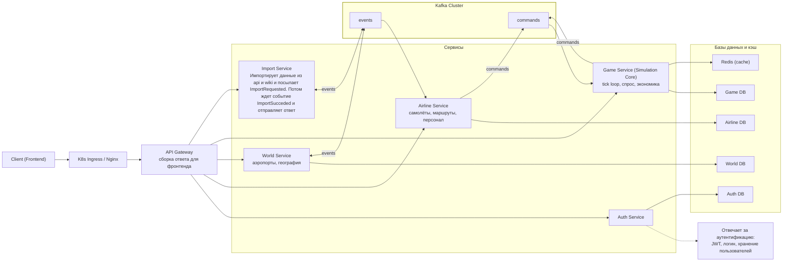

# AirlineSim

---

## Architecture diagram

```mermaid
flowchart LR

    %% Клиент и вход
    CLIENT["Client (Frontend)"]
    INGRESS["K8s Ingress / Nginx"]
    GATEWAY["API Gateway<br>сборка ответа для фронтенда"]

    CLIENT --> INGRESS --> GATEWAY

    %% Сервисы (группируем)
    subgraph SERVICES [Сервисы]
        direction TB
        AUTH["Auth Service"]
        AIRLINE["Airline Service<br>самолёты, маршруты, персонал"]
        WORLD["World Service<br>аэропорты, география"]
        GAME["Game Service (Simulation Core)<br>tick loop, спрос, экономика"]
        IMPORT["Import Service<br>Импортирует данные из api и wiki и посылает ImportRequested. Потом ждет событие ImportSucceded и отправляет ответ"]
        
    end
    
    %% блоки с комментариями
    AUTH_DESC["Отвечает за аутентификацию:<br>JWT, логин, хранение пользователей"]
    AUTH -.-> AUTH_DESC

    %% Брокер
    subgraph KAFKA [Kafka Cluster]
        direction LR
        TOPIC_COMMANDS["commands"]
        TOPIC_EVENTS["events"]
    end

    %% Хранилища
    subgraph DATA [Базы данных и кэш]
        direction TB
        AUTH_DB["Auth DB"]
        AIRLINE_DB["Airline DB"]
        WORLD_DB["World DB"]
        GAME_DB["Game DB"]
        REDIS["Redis (cache)"]
    end

    %% Связи: API Gateway → сервисы
    GATEWAY --> AUTH
    GATEWAY --> AIRLINE
    GATEWAY --> WORLD
    GATEWAY --> GAME
    GATEWAY --> IMPORT

    %% Сервисы → свои БД
    AUTH --> AUTH_DB
    AIRLINE --> AIRLINE_DB
    WORLD --> WORLD_DB
    GAME --> GAME_DB

    %% Команды (от сервисов в брокер)
    AIRLINE -->|commands| TOPIC_COMMANDS
    GAME -->|commands| TOPIC_COMMANDS

    %% Команды → Game (получение команд)
    TOPIC_COMMANDS --> GAME

    %% События (World, Game, Import → events)
    WORLD <-->|events| TOPIC_EVENTS
    IMPORT <-->|events| TOPIC_EVENTS


    %% Подписка на события
    TOPIC_EVENTS --> AIRLINE

    %% Кэш
    GAME --> REDIS

    %% Стилизация для улучшения читаемости
    style KAFKA fill:stroke:#333,stroke-width:2px
    style SERVICES fill:stroke:#333
    style DATA fill:stroke:#333
```