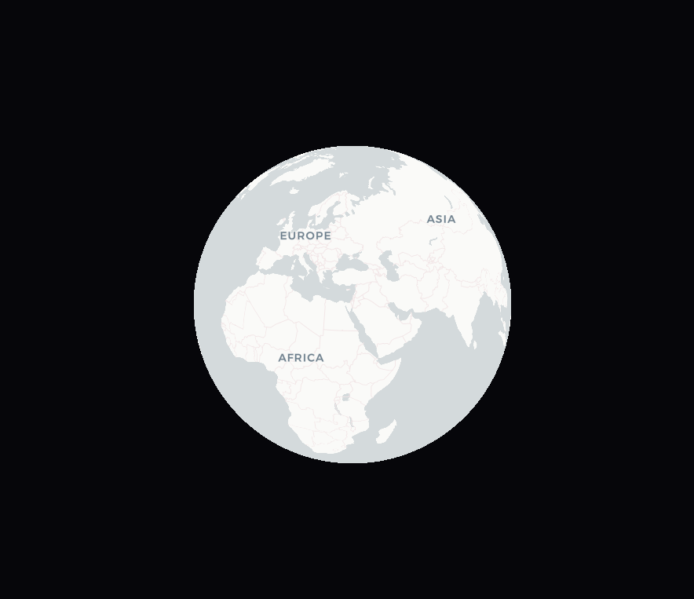
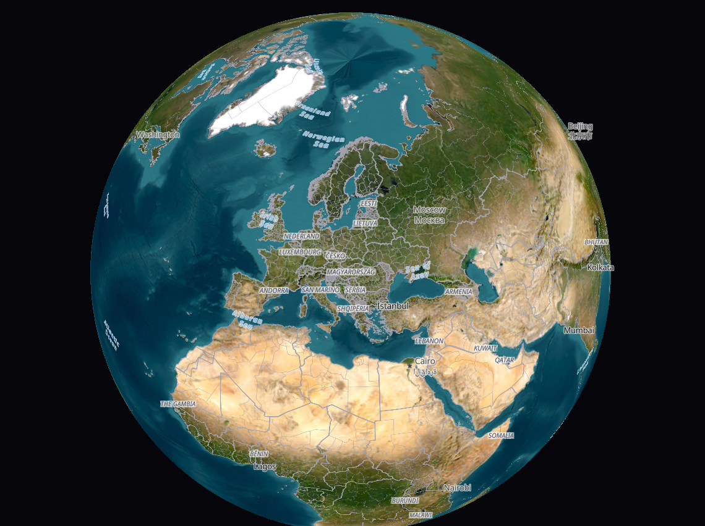
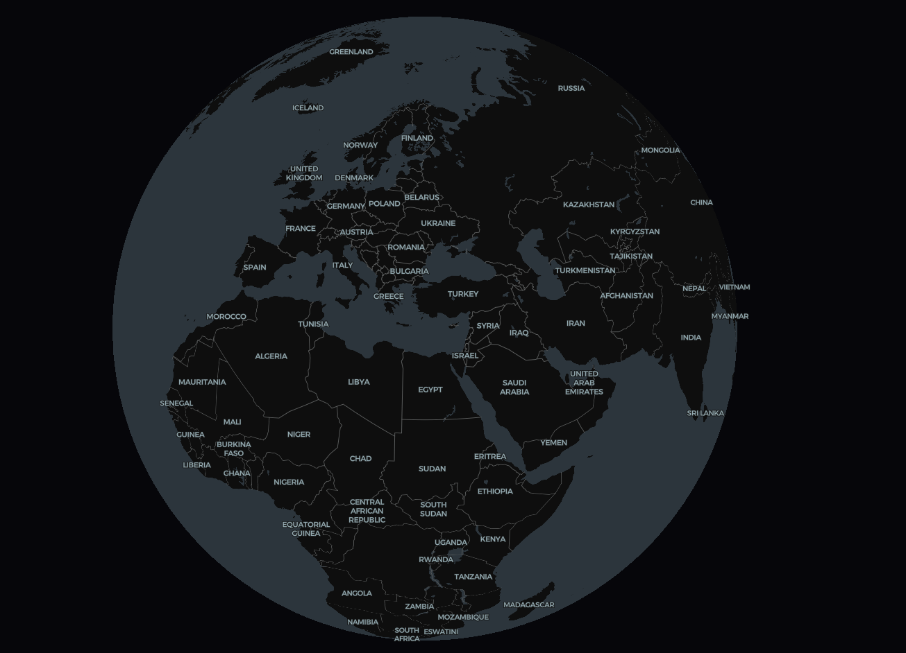
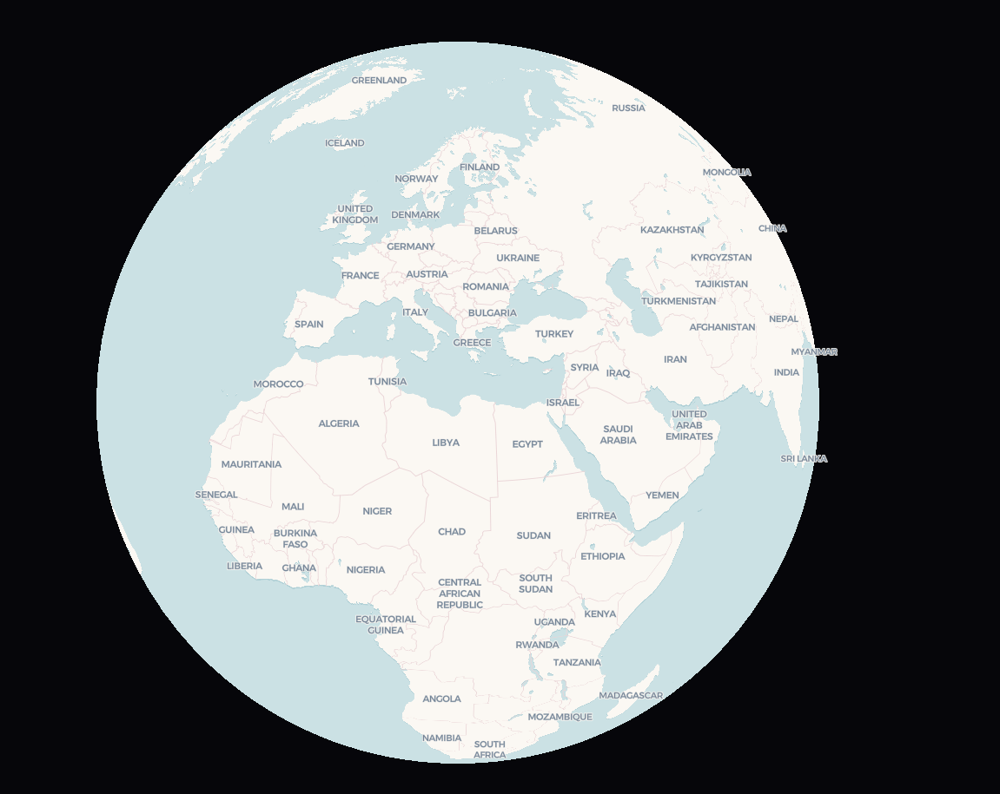

1. https://basemaps.cartocdn.com/gl/positron-gl-style/style.json

2. https://raw.githubusercontent.com/go2garret/maps/main/src/assets/json/arcgis_hybrid.json

3. https://basemaps.cartocdn.com/gl/dark-matter-gl-style/style.json

4. https://basemaps.cartocdn.com/gl/voyager-gl-style/style.json

## Architecture Context

Эти стили относятся к remote `World Map` из схемы `../../../docs/FE.png`. Карта подключается в `Shell / Host` рядом с целевыми remotes `Fleet & Ops`, `Finance & Stock`, `Network Planner`, `Events & News`, `HR & Facilities` и должна использовать общую тему из `air-ui`.

