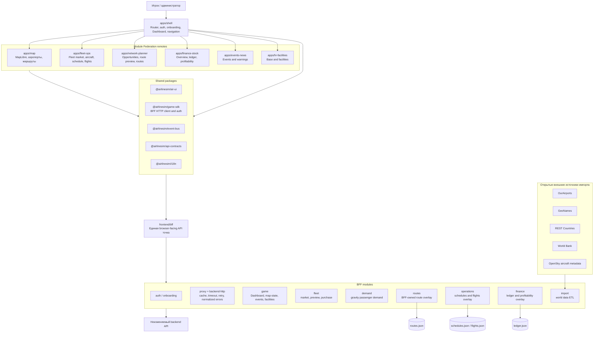

# Схема модулей приложения

## Ключевые правила

- URL в Shell является источником истины для выбора MFE.
- Browser-facing приложения вызывают только BFF.
- BFF вызывает backend через `requestBackend` / `requestBackendJson`.
- Routes, schedules, flights и ledger временно принадлежат BFF до появления backend endpoints.
- Demand сохраняет среднегодовой базовый спрос в backend `RegionLink`.
- OpenSky подтверждает идентичность реальных типов ВС; игровые эксплуатационные поля остаются курируемыми.

