# Общая архитектурная диаграмма (PlantUML)

Эта диаграмма отображает реальную архитектуру проекта, включая взаимосвязи хост-приложения (Shell), удаленных MFE-модулей, общих пакетов, BFF и внешних источников данных.

```plantuml
@startuml
skinparam handwritten false
skinparam monochrome false
skinparam packageStyle rect
skinparam shadowing false
skinparam defaultFontName "Arial"

actor "Игрок / Администратор" as User

package "Frontend" {
    component "Shell (Хост)\napps/shell\n- Router, auth, onboarding\n- Dashboard (dashboard-owner)\n- Navigation & Layouts" as Shell
    
    package "MFE Remotes (Module Federation)" {
        component "Events & News\napps/events-news" as EventsMFE
        component "World Map\napps/map\n(Svelte visual widget)" as MapMFE
        component "Finance & Stock\napps/finance-stock" as FinanceMFE
        component "HR & Facilities\napps/hr-facilities" as HRMFE
        component "Network Planner\napps/network-planner" as NetworkMFE
        component "Fleet & Ops\napps/fleet-ops" as FleetMFE
    }

    package "Shared Packages (packages/*)" {
        component "@airlinesim/i18n\n(Localization en/ru)" as I18n
        component "@airlinesim/api-contracts\n(OpenAPI types & Zod)" as Contracts
        component "@airlinesim/event-bus\n(Cross-MFE bus singleton)" as EventBus
        component "@airlinesim/air-ui\n(Tailwind ui-kit & stories)" as AirUI
        component "@airlinesim/game-sdk\n(API Client)" as GameSDK
    }
}

package "BFF (frontend/bff)" {
    component "BFF Browser-facing API" as BFF
    
    package "BFF Modules (bff/src/modules)" {
        component "import\n(World data ETL)" as ImportMod
        component "proxy & backend-http\n(cache, retry, errors)" as ProxyMod
        component "game\n(Dashboard, map-state)" as GameMod
        component "auth / onboarding" as AuthMod
        component "fleet\n(market, purchase, preview)" as FleetMod
        component "demand\n(gravity model)" as DemandMod
        component "operations\n(schedules & flights)" as OpsMod
        component "finance\n(ledger & profitability)" as FinMod
        component "routes\n(route overlay)" as RoutesMod
    }
    
    package "BFF-owned Overlay Storage" {
        database "schedules.json\nflights.json" as SchedulesDb
        database "ledger.json" as LedgerDb
        database "routes.json" as RoutesDb
    }
}

package "External Import Sources" {
    component "OurAirports" as OurAirports
    component "GeoNames" as GeoNames
    component "REST Countries" as RESTCountries
    component "World Bank" as WorldBank
    component "OpenSky" as OpenSky
}

database "Backend API\n(ReadOnly / Immutable)" as Backend

User --> Shell

' Shell to MFEs
Shell --> MapMFE : mounts as visual widget
Shell --> FleetMFE : mounts via routing
Shell --> NetworkMFE : mounts via routing
Shell --> FinanceMFE : mounts via routing
Shell --> EventsMFE : mounts via routing
Shell --> HRMFE : mounts via routing

' MFE and Shell using Shared
Shell ..> I18n : uses
Shell ..> EventBus : uses
Shell ..> AirUI : uses
Shell ..> GameSDK : uses

EventsMFE ..> I18n : uses
EventsMFE ..> Contracts : uses
EventsMFE ..> EventBus : uses
EventsMFE ..> AirUI : uses
EventsMFE ..> GameSDK : uses

MapMFE ..> I18n : uses
MapMFE ..> EventBus : uses
MapMFE ..> GameSDK : uses

FinanceMFE ..> I18n : uses
FinanceMFE ..> Contracts : uses
FinanceMFE ..> EventBus : uses
FinanceMFE ..> AirUI : uses
FinanceMFE ..> GameSDK : uses

HRMFE ..> I18n : uses
HRMFE ..> Contracts : uses
HRMFE ..> EventBus : uses
HRMFE ..> AirUI : uses
HRMFE ..> GameSDK : uses

NetworkMFE ..> I18n : uses
NetworkMFE ..> Contracts : uses
NetworkMFE ..> EventBus : uses
NetworkMFE ..> AirUI : uses
NetworkMFE ..> GameSDK : uses

FleetMFE ..> I18n : uses
FleetMFE ..> Contracts : uses
FleetMFE ..> EventBus : uses
FleetMFE ..> AirUI : uses
FleetMFE ..> GameSDK : uses

' GameSDK interacts with BFF
GameSDK --> BFF : HTTP / JSON

' BFF to modules
BFF --> ImportMod
BFF --> ProxyMod
BFF --> GameMod
BFF --> AuthMod
BFF --> FleetMod
BFF --> DemandMod
BFF --> OpsMod
BFF --> FinMod
BFF --> RoutesMod

' External to Import
OurAirports --> ImportMod
GeoNames --> ImportMod
RESTCountries --> ImportMod
WorldBank --> ImportMod
OpenSky --> ImportMod

' Modules to Overlay Storage
OpsMod --> SchedulesDb
FinMod --> LedgerDb
RoutesMod --> RoutesDb

' BFF modules to backend
ImportMod --> Backend
ProxyMod --> Backend
GameMod --> Backend
AuthMod --> Backend
FleetMod --> Backend
DemandMod --> Backend
OpsMod --> Backend
FinMod --> Backend
RoutesMod --> Backend

@enduml
```

## Ключевые архитектурные правила
1. **Точка входа (Shell)**: Владеет авторизацией, онбордингом новой авиакомпании и дашбордом.
2. **Карта (apps/map)**: Не является самостоятельным разделом, а встраивается как визуальный виджет в Dashboard или другие разделы.
3. **Общие пакеты (Shared Packages)**:
   - `@airlinesim/event-bus` — используется для межмодульных действий и синхронизации виджетов (например, клик по самолету на карте обрабатывается в Dashboard).
   - `@airlinesim/game-sdk` — выступает единым HTTP-клиентом для общения с BFF.
4. **BFF (frontend/bff)**: Все браузерные приложения общаются только с BFF. BFF выполняет проксирование в неизменяемый Backend API, кэширование, а также берет на себя хранение наложенных слоев (overlays) данных (схемы полетов, журнал проводок, маршруты), пока соответствующие эндпоинты не реализованы на бэкенде.
