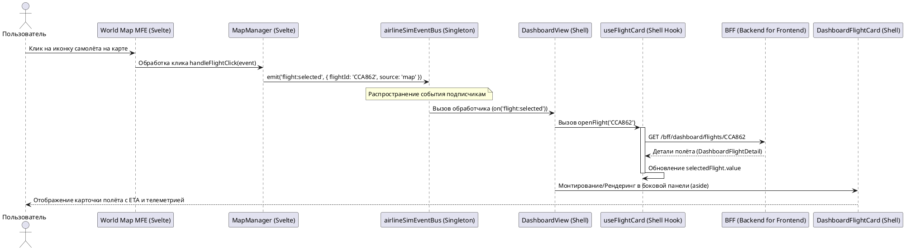

# Сценарий выбора рейса на карте и синхронизации с Dashboard

Эта диаграмма описывает реальный процесс выбора рейса/самолета пользователем на карте (`apps/map`) и последующий показ карточки рейса в боковой панели дашборда Shell.

## Ключевые отличия от старой схемы (MFE_EXAMPLE.png):
1. **Подписчики на события**: Модуль `fleet-ops` вообще не слушает и не реагирует на событие `flight:selected` в рамках этого дашборд-сценария.
2. **Владелец данных и рендеринга**: Маршрут `/dashboard` и сам Dashboard полностью принадлежат Shell. Загрузка данных по рейсу происходит из Shell через BFF-эндпоинт (`/bff/dashboard/flights/:id`), и рендеринг карточки рейса (`DashboardFlightCard.vue`) выполняется на стороне Shell, а не удаленным приложением.
3. **Визуальный виджет**: Модуль `apps/map` выступает исключительно как интерактивный визуальный виджет, получающий состояние сети от Shell и отправляющий события взаимодействия обратно в Shell через общую шину событий.
