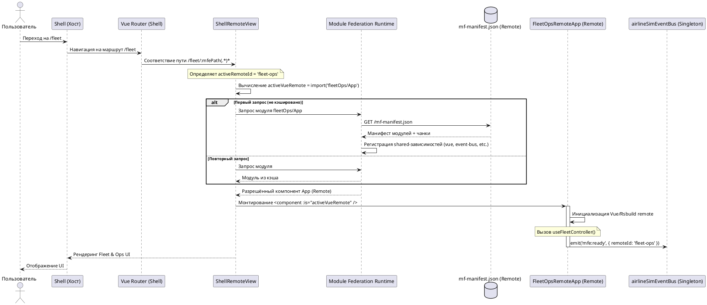

# Последовательность навигации и загрузки MFE (Module Federation)

Эта диаграмма описывает реальный процесс навигации пользователя на роут remote-приложения (например, `/fleet`), динамического разрешения зависимости через Module Federation v2 и монтирования приложения.

## Ключевые отличия от старой схемы (MFE-MF-CONNECT-EXAMPLE.png):
1. **Разрешение путей**: На хосте роуты мапятся на wildcard-путь вида `${route.pathPrefix}/:mfePath(.*)*`, которые рендерит компонент `ShellRemoteView.vue`. Динамический импорт идет по пути `"fleetOps/App"`, где `fleetOps` — имя remote из реестра Module Federation, а `./App` — экспортируемая точка входа (а не `"fleet-ops/FleetApp"`).
2. **Module Federation v2**: Вместо прямого запроса `/remoteEntry.js` используется манифест манифестов `mf-manifest.json` для автоматического получения сведений о версии и чанках.
3. **mfe:ready**: Событие отправляется в шину `airlineSimEventBus` в виде объекта `{ remoteId: 'fleet-ops' }` (а не простой строки).
